```mermaid
flowchart TB
    subgraph upstream["Dependants (2)"]
        P1["<b>📦&nbsp;SoftwareCenter.Host.csproj</b><br/><small>net8.0</small>"]
        P6["<b>📦&nbsp;SoftwareCenter.UIManager.csproj</b><br/><small>net8.0</small>"]
        click P1 "#hostsoftwarecenterhostcsproj"
        click P6 "#contract,-ui-&-routinguimanagersoftwarecenteruimanagercsproj"
    end
    subgraph current["SoftwareCenter.Kernel.csproj"]
        MAIN["<b>📦&nbsp;SoftwareCenter.Kernel.csproj</b><br/><small>net8.0</small>"]
        click MAIN "#contract,-ui-&-routingkernelsoftwarecenterkernelcsproj"
    end
    subgraph downstream["Dependencies (1"]
        P4["<b>📦&nbsp;SoftwareCenter.Core.csproj</b><br/><small>net8.0</small>"]
        click P4 "#contract,-ui-&-routingcoresoftwarecentercorecsproj"
    end
    P1 --> MAIN
    P6 --> MAIN
    MAIN --> P4

```

```mermaid
flowchart TB
    subgraph upstream["Dependants (1)"]
        P1["<b>📦&nbsp;SoftwareCenter.Host.csproj</b><br/><small>net8.0</small>"]
        click P1 "#hostsoftwarecenterhostcsproj"
    end
    subgraph current["SoftwareCenter.UIManager.csproj"]
        MAIN["<b>📦&nbsp;SoftwareCenter.UIManager.csproj</b><br/><small>net8.0</small>"]
        click MAIN "#contract,-ui-&-routinguimanagersoftwarecenteruimanagercsproj"
    end
    subgraph downstream["Dependencies (2"]
        P4["<b>📦&nbsp;SoftwareCenter.Core.csproj</b><br/><small>net8.0</small>"]
        P5["<b>📦&nbsp;SoftwareCenter.Kernel.csproj</b><br/><small>net8.0</small>"]
        click P4 "#contract,-ui-&-routingcoresoftwarecentercorecsproj"
        click P5 "#contract,-ui-&-routingkernelsoftwarecenterkernelcsproj"
    end
    P1 --> MAIN
    MAIN --> P4
    MAIN --> P5

```

```mermaid
flowchart TB
    subgraph current["SoftwareCenter.Host.csproj"]
        MAIN["<b>📦&nbsp;SoftwareCenter.Host.csproj</b><br/><small>net8.0</small>"]
        click MAIN "#hostsoftwarecenterhostcsproj"
    end
    subgraph downstream["Dependencies (2"]
        P6["<b>📦&nbsp;SoftwareCenter.UIManager.csproj</b><br/><small>net8.0</small>"]
        P5["<b>📦&nbsp;SoftwareCenter.Kernel.csproj</b><br/><small>net8.0</small>"]
        click P6 "#contract,-ui-&-routinguimanagersoftwarecenteruimanagercsproj"
        click P5 "#contract,-ui-&-routingkernelsoftwarecenterkernelcsproj"
    end
    MAIN --> P6
    MAIN --> P5

```

```mermaid
flowchart TB
    subgraph current["SoftwareCenter.Module.AI.Agent.csproj"]
        MAIN["<b>📦&nbsp;SoftwareCenter.Module.AI.Agent.csproj</b><br/><small>net8.0</small>"]
        click MAIN "#modulesaiagentsoftwarecentermoduleaiagentcsproj"
    end
    subgraph downstream["Dependencies (1"]
        P4["<b>📦&nbsp;SoftwareCenter.Core.csproj</b><br/><small>net8.0</small>"]
        click P4 "#contract,-ui-&-routingcoresoftwarecentercorecsproj"
    end
    MAIN --> P4

```

```mermaid
flowchart TB
    subgraph current["SoftwareCenter.Module.AppManager.csproj"]
        MAIN["<b>📦&nbsp;SoftwareCenter.Module.AppManager.csproj</b><br/><small>net8.0</small>"]
        click MAIN "#modulesappmanagersoftwarecentermoduleappmanagercsproj"
    end
    subgraph downstream["Dependencies (1"]
        P4["<b>📦&nbsp;SoftwareCenter.Core.csproj</b><br/><small>net8.0</small>"]
        click P4 "#contract,-ui-&-routingcoresoftwarecentercorecsproj"
    end
    MAIN --> P4

```

```mermaid
flowchart TB
    subgraph current["SoftwareCenter.Module.DBManager.csproj"]
        MAIN["<b>📦&nbsp;SoftwareCenter.Module.DBManager.csproj</b><br/><small>net8.0</small>"]
        click MAIN "#modulesdbmanagersoftwarecentermoduledbmanagercsproj"
    end
    subgraph downstream["Dependencies (1"]
        P4["<b>📦&nbsp;SoftwareCenter.Core.csproj</b><br/><small>net8.0</small>"]
        click P4 "#contract,-ui-&-routingcoresoftwarecentercorecsproj"
    end
    MAIN --> P4

```

```mermaid
flowchart TB
    subgraph current["SoftwareCenter.Module.LogNotifManager.csproj"]
        MAIN["<b>📦&nbsp;SoftwareCenter.Module.LogNotifManager.csproj</b><br/><small>net8.0</small>"]
        click MAIN "#moduleslognotifmanagersoftwarecentermodulelognotifmanagercsproj"
    end
    subgraph downstream["Dependencies (1"]
        P4["<b>📦&nbsp;SoftwareCenter.Core.csproj</b><br/><small>net8.0</small>"]
        click P4 "#contract,-ui-&-routingcoresoftwarecentercorecsproj"
    end
    MAIN --> P4

```

```mermaid
flowchart TB
    subgraph current["SoftwareCenter.Module.SourceManager.csproj"]
        MAIN["<b>📦&nbsp;SoftwareCenter.Module.SourceManager.csproj</b><br/><small>net8.0</small>"]
        click MAIN "#modulessourcemanagersoftwarecentermodulesourcemanagercsproj"
    end
    subgraph downstream["Dependencies (1"]
        P4["<b>📦&nbsp;SoftwareCenter.Core.csproj</b><br/><small>net8.0</small>"]
        click P4 "#contract,-ui-&-routingcoresoftwarecentercorecsproj"
    end
    MAIN --> P4

```

# Projects and dependencies analysis

This document provides a comprehensive overview of the projects and their dependencies in the context of upgrading to .NETCoreApp,Version=v10.0.

## Table of Contents

- [Executive Summary](#executive-Summary)
  - [Highlevel Metrics](#highlevel-metrics)
  - [Projects Compatibility](#projects-compatibility)
  - [Package Compatibility](#package-compatibility)
  - [API Compatibility](#api-compatibility)
- [Aggregate NuGet packages details](#aggregate-nuget-packages-details)
- [Top API Migration Challenges](#top-api-migration-challenges)
  - [Technologies and Features](#technologies-and-features)
  - [Most Frequent API Issues](#most-frequent-api-issues)
- [Projects Relationship Graph](#projects-relationship-graph)
- [Project Details](#project-details)

  - [Contract, UI & Routing\Core\SoftwareCenter.Core.csproj](#contract,-ui-&-routingcoresoftwarecentercorecsproj)
  - [Contract, UI & Routing\Kernel\SoftwareCenter.Kernel.csproj](#contract,-ui-&-routingkernelsoftwarecenterkernelcsproj)
  - [Contract, UI & Routing\UIManager\SoftwareCenter.UIManager.csproj](#contract,-ui-&-routinguimanagersoftwarecenteruimanagercsproj)
  - [Host\SoftwareCenter.Host.csproj](#hostsoftwarecenterhostcsproj)
  - [Modules\AI.Agent\SoftwareCenter.Module.AI.Agent.csproj](#modulesaiagentsoftwarecentermoduleaiagentcsproj)
  - [Modules\AppManager\SoftwareCenter.Module.AppManager.csproj](#modulesappmanagersoftwarecentermoduleappmanagercsproj)
  - [Modules\CredManager\SoftwareCenter.Module.CredManager.csproj](#modulescredmanagersoftwarecentermodulecredmanagercsproj)
  - [Modules\DBManager\SoftwareCenter.Module.DBManager.csproj](#modulesdbmanagersoftwarecentermoduledbmanagercsproj)
  - [Modules\LogNotifManager\SoftwareCenter.Module.LogNotifManager.csproj](#moduleslognotifmanagersoftwarecentermodulelognotifmanagercsproj)
  - [Modules\SourceManager\SoftwareCenter.Module.SourceManager.csproj](#modulessourcemanagersoftwarecentermodulesourcemanagercsproj)

## Executive Summary

### Highlevel Metrics

| Metric | Count | Status |
| :--- | :---: | :--- |
| Total Projects | 12 | All require upgrade |
| Total NuGet Packages | 8 | All compatible |
| Total Code Files | 99 |  |
| Total Code Files with Incidents | 12 |  |
| Total Lines of Code | 4796 |  |
| Total Number of Issues | 16 |  |
| Estimated LOC to modify | 6+ | at least 0.1% of codebase |

### Projects Compatibility

| Project | Target Framework | Difficulty | Package Issues | API Issues | Est. LOC Impact | Description |
| :--- | :---: | :---: | :---: | :---: | :---: | :--- |
| [Contract, UI & Routing\Core\SoftwareCenter.Core.csproj](#contract,-ui-&-routingcoresoftwarecentercorecsproj) | net8.0 | 🟢 Low | 0 | 0 |  | ClassLibrary, Sdk Style = True |
| [Contract, UI & Routing\Kernel\SoftwareCenter.Kernel.csproj](#contract,-ui-&-routingkernelsoftwarecenterkernelcsproj) | net8.0 | 🟢 Low | 0 | 3 | 3+ | ClassLibrary, Sdk Style = True |
| [Contract, UI & Routing\UIManager\SoftwareCenter.UIManager.csproj](#contract,-ui-&-routinguimanagersoftwarecenteruimanagercsproj) | net8.0 | 🟢 Low | 0 | 0 |  | ClassLibrary, Sdk Style = True |
| [Host\SoftwareCenter.Host.csproj](#hostsoftwarecenterhostcsproj) | net8.0 | 🟢 Low | 0 | 3 | 3+ | AspNetCore, Sdk Style = True |
| [Modules\AI.Agent\SoftwareCenter.Module.AI.Agent.csproj](#modulesaiagentsoftwarecentermoduleaiagentcsproj) | net8.0 | 🟢 Low | 0 | 0 |  | ClassLibrary, Sdk Style = True |
| [Modules\AppManager\SoftwareCenter.Module.AppManager.csproj](#modulesappmanagersoftwarecentermoduleappmanagercsproj) | net8.0 | 🟢 Low | 0 | 0 |  | ClassLibrary, Sdk Style = True |
| [Modules\CredManager\SoftwareCenter.Module.CredManager.csproj](#modulescredmanagersoftwarecentermodulecredmanagercsproj) | net8.0 | 🟢 Low | 0 | 0 |  | ClassLibrary, Sdk Style = True |
| [Modules\DBManager\SoftwareCenter.Module.DBManager.csproj](#modulesdbmanagersoftwarecentermoduledbmanagercsproj) | net8.0 | 🟢 Low | 0 | 0 |  | ClassLibrary, Sdk Style = True |
| [Modules\LogNotifManager\SoftwareCenter.Module.LogNotifManager.csproj](#moduleslognotifmanagersoftwarecentermodulelognotifmanagercsproj) | net8.0 | 🟢 Low | 0 | 0 |  | ClassLibrary, Sdk Style = True |
| [Modules\SourceManager\SoftwareCenter.Module.SourceManager.csproj](#modulessourcemanagersoftwarecentermodulesourcemanagercsproj) | net8.0 | 🟢 Low | 0 | 0 |  | ClassLibrary, Sdk Style = True |

### Package Compatibility

| Status | Count | Percentage |
| :--- | :---: | :---: |
| ✅ Compatible | 8 | 100.0% |
| ⚠️ Incompatible | 0 | 0.0% |
| 🔄 Upgrade Recommended | 0 | 0.0% |
| ***Total NuGet Packages*** | ***8*** | ***100%*** |

### API Compatibility

| Category | Count | Impact |
| :--- | :---: | :--- |
| 🔴 Binary Incompatible | 0 | High - Require code changes |
| 🟡 Source Incompatible | 3 | Medium - Needs re-compilation and potential conflicting API error fixing |
| 🔵 Behavioral change | 3 | Low - Behavioral changes that may require testing at runtime |
| ✅ Compatible | 3752 |  |
| ***Total APIs Analyzed*** | ***3758*** |  |

## Aggregate NuGet packages details

| Package | Current Version | Suggested Version | Projects | Description |
| :--- | :---: | :---: | :--- | :--- |
| HtmlAgilityPack | 1.12.4 |  | [SoftwareCenter.UIManager.csproj](#contract,-ui-&-routinguimanagersoftwarecenteruimanagercsproj) | ✅Compatible |
| LiteDB | 5.0.21 |  | [SoftwareCenter.Kernel.csproj](#contract,-ui-&-routingkernelsoftwarecenterkernelcsproj) | ✅Compatible |
| Microsoft.Extensions.DependencyInjection | 10.0.1 |  | [SoftwareCenter.Kernel.csproj](#contract,-ui-&-routingkernelsoftwarecenterkernelcsproj) | ✅Compatible |
| Microsoft.Extensions.DependencyInjection.Abstractions | 10.0.1 |  | [SoftwareCenter.Core.csproj](#contract,-ui-&-routingcoresoftwarecentercorecsproj) [SoftwareCenter.Kernel.csproj](#contract,-ui-&-routingkernelsoftwarecenterkernelcsproj) | ✅Compatible |
| Microsoft.Extensions.Hosting | 10.0.1 |  | [SoftwareCenter.Kernel.csproj](#contract,-ui-&-routingkernelsoftwarecenterkernelcsproj) | ✅Compatible |
| Microsoft.Extensions.Hosting.Abstractions | 10.0.1 |  | [SoftwareCenter.Kernel.csproj](#contract,-ui-&-routingkernelsoftwarecenterkernelcsproj) | ✅Compatible |
| Microsoft.Extensions.Logging | 10.0.1 |  | [SoftwareCenter.Kernel.csproj](#contract,-ui-&-routingkernelsoftwarecenterkernelcsproj) | ✅Compatible |
| Microsoft.Extensions.Logging.Abstractions | 10.0.1 |  | [SoftwareCenter.Core.csproj](#contract,-ui-&-routingcoresoftwarecentercorecsproj) [SoftwareCenter.Kernel.csproj](#contract,-ui-&-routingkernelsoftwarecenterkernelcsproj) | ✅Compatible |

## Top API Migration Challenges

### Technologies and Features

| Technology | Issues | Percentage | Migration Path |
| :--- | :---: | :---: | :--- |

### Most Frequent API Issues

| API | Count | Percentage | Category |
| :--- | :---: | :---: | :--- |
| M:System.TimeSpan.FromSeconds(System.Double) | 2 | 33.3% | Source Incompatible |
| M:Microsoft.AspNetCore.Builder.ExceptionHandlerExtensions.UseExceptionHandler(Microsoft.AspNetCore.Builder.IApplicationBuilder,System.String) | 1 | 16.7% | Behavioral Change |
| M:System.Text.Json.JsonSerializer.Deserialize(System.Text.Json.JsonElement,System.Type,System.Text.Json.JsonSerializerOptions) | 1 | 16.7% | Behavioral Change |
| M:Microsoft.Extensions.Logging.ConsoleLoggerExtensions.AddConsole(Microsoft.Extensions.Logging.ILoggingBuilder) | 1 | 16.7% | Behavioral Change |
| M:System.TimeSpan.FromMinutes(System.Double) | 1 | 16.7% | Source Incompatible |

## Projects Relationship Graph

Legend:
📦 SDK-style project
⚙️ Classic project

```mermaid
flowchart LR
    P1["<b>📦&nbsp;SoftwareCenter.Host.csproj</b><br/><small>net8.0</small>"]
    P4["<b>📦&nbsp;SoftwareCenter.Core.csproj</b><br/><small>net8.0</small>"]
    P5["<b>📦&nbsp;SoftwareCenter.Kernel.csproj</b><br/><small>net8.0</small>"]
    P6["<b>📦&nbsp;SoftwareCenter.UIManager.csproj</b><br/><small>net8.0</small>"]
    P7["<b>📦&nbsp;SoftwareCenter.Module.AI.Agent.csproj</b><br/><small>net8.0</small>"]
    P8["<b>📦&nbsp;SoftwareCenter.Module.AppManager.csproj</b><br/><small>net8.0</small>"]
    P9["<b>📦&nbsp;SoftwareCenter.Module.CredManager.csproj</b><br/><small>net8.0</small>"]
    P10["<b>📦&nbsp;SoftwareCenter.Module.DBManager.csproj</b><br/><small>net8.0</small>"]
    P11["<b>📦&nbsp;SoftwareCenter.Module.LogNotifManager.csproj</b><br/><small>net8.0</small>"]
    P12["<b>📦&nbsp;SoftwareCenter.Module.SourceManager.csproj</b><br/><small>net8.0</small>"]
    P1 --> P6
    P1 --> P5
    P5 --> P4
    P6 --> P4
    P6 --> P5
    P7 --> P4
    P8 --> P4
    P9 --> P4
    P10 --> P4
    P11 --> P4
    P12 --> P4
    click P1 "#hostsoftwarecenterhostcsproj"
    click P4 "#contract,-ui-&-routingcoresoftwarecentercorecsproj"
    click P5 "#contract,-ui-&-routingkernelsoftwarecenterkernelcsproj"
    click P6 "#contract,-ui-&-routinguimanagersoftwarecenteruimanagercsproj"
    click P7 "#modulesaiagentsoftwarecentermoduleaiagentcsproj"
    click P8 "#modulesappmanagersoftwarecentermoduleappmanagercsproj"
    click P9 "#modulescredmanagersoftwarecentermodulecredmanagercsproj"
    click P10 "#modulesdbmanagersoftwarecentermoduledbmanagercsproj"
    click P11 "#moduleslognotifmanagersoftwarecentermodulelognotifmanagercsproj"
    click P12 "#modulessourcemanagersoftwarecentermodulesourcemanagercsproj"

```

## Project Details

### Contract, UI & Routing\Core\SoftwareCenter.Core.csproj

#### Project Info

- **Current Target Framework:** net8.0
- **Proposed Target Framework:** net10.0
- **SDK-style**: True
- **Project Kind:** ClassLibrary
- **Dependencies**: 0
- **Dependants**: 8
- **Number of Files**: 45
- **Number of Files with Incidents**: 1
- **Lines of Code**: 1258
- **Estimated LOC to modify**: 0+ (at least 0.0% of the project)

#### Dependency Graph

Legend:
📦 SDK-style project
⚙️ Classic project

### API Compatibility

| Category | Count | Impact |
| :--- | :---: | :--- |
| 🔴 Binary Incompatible | 0 | High - Require code changes |
| 🟡 Source Incompatible | 0 | Medium - Needs re-compilation and potential conflicting API error fixing |
| 🔵 Behavioral change | 0 | Low - Behavioral changes that may require testing at runtime |
| ✅ Compatible | 662 |  |
| ***Total APIs Analyzed*** | ***662*** |  |

### Contract, UI & Routing\Kernel\SoftwareCenter.Kernel.csproj

#### Project Info

- **Current Target Framework:** net8.0
- **Proposed Target Framework:** net10.0
- **SDK-style**: True
- **Project Kind:** ClassLibrary
- **Dependencies**: 1
- **Dependants**: 2
- **Number of Files**: 29
- **Number of Files with Incidents**: 2
- **Lines of Code**: 2183
- **Estimated LOC to modify**: 3+ (at least 0.1% of the project)

#### Dependency Graph

Legend:
📦 SDK-style project
⚙️ Classic project

### API Compatibility

| Category | Count | Impact |
| :--- | :---: | :--- |
| 🔴 Binary Incompatible | 0 | High - Require code changes |
| 🟡 Source Incompatible | 3 | Medium - Needs re-compilation and potential conflicting API error fixing |
| 🔵 Behavioral change | 0 | Low - Behavioral changes that may require testing at runtime |
| ✅ Compatible | 1849 |  |
| ***Total APIs Analyzed*** | ***1852*** |  |

### Contract, UI & Routing\UIManager\SoftwareCenter.UIManager.csproj

#### Project Info

- **Current Target Framework:** net8.0
- **Proposed Target Framework:** net10.0
- **SDK-style**: True
- **Project Kind:** ClassLibrary
- **Dependencies**: 2
- **Dependants**: 1
- **Number of Files**: 16
- **Number of Files with Incidents**: 1
- **Lines of Code**: 849
- **Estimated LOC to modify**: 0+ (at least 0.0% of the project)

#### Dependency Graph

Legend:
📦 SDK-style project
⚙️ Classic project

### API Compatibility

| Category | Count | Impact |
| :--- | :---: | :--- |
| 🔴 Binary Incompatible | 0 | High - Require code changes |
| 🟡 Source Incompatible | 0 | Medium - Needs re-compilation and potential conflicting API error fixing |
| 🔵 Behavioral change | 0 | Low - Behavioral changes that may require testing at runtime |
| ✅ Compatible | 587 |  |
| ***Total APIs Analyzed*** | ***587*** |  |

### Host\SoftwareCenter.Host.csproj

#### Project Info

- **Current Target Framework:** net8.0
- **Proposed Target Framework:** net10.0
- **SDK-style**: True
- **Project Kind:** AspNetCore
- **Dependencies**: 2
- **Dependants**: 0
- **Number of Files**: 24
- **Number of Files with Incidents**: 2
- **Lines of Code**: 506
- **Estimated LOC to modify**: 3+ (at least 0.6% of the project)

#### Dependency Graph

Legend:
📦 SDK-style project
⚙️ Classic project

### API Compatibility

| Category | Count | Impact |
| :--- | :---: | :--- |
| 🔴 Binary Incompatible | 0 | High - Require code changes |
| 🟡 Source Incompatible | 0 | Medium - Needs re-compilation and potential conflicting API error fixing |
| 🔵 Behavioral change | 3 | Low - Behavioral changes that may require testing at runtime |
| ✅ Compatible | 654 |  |
| ***Total APIs Analyzed*** | ***657*** |  |

### Modules\AI.Agent\SoftwareCenter.Module.AI.Agent.csproj

#### Project Info

- **Current Target Framework:** net8.0
- **Proposed Target Framework:** net10.0
- **SDK-style**: True
- **Project Kind:** ClassLibrary
- **Dependencies**: 1
- **Dependants**: 0
- **Number of Files**: 4
- **Number of Files with Incidents**: 1
- **Lines of Code**: 0
- **Estimated LOC to modify**: 0+ (at least 0.0% of the project)

#### Dependency Graph

Legend:
📦 SDK-style project
⚙️ Classic project

### API Compatibility

| Category | Count | Impact |
| :--- | :---: | :--- |
| 🔴 Binary Incompatible | 0 | High - Require code changes |
| 🟡 Source Incompatible | 0 | Medium - Needs re-compilation and potential conflicting API error fixing |
| 🔵 Behavioral change | 0 | Low - Behavioral changes that may require testing at runtime |
| ✅ Compatible | 0 |  |
| ***Total APIs Analyzed*** | ***0*** |  |

### Modules\AppManager\SoftwareCenter.Module.AppManager.csproj

#### Project Info

- **Current Target Framework:** net8.0
- **Proposed Target Framework:** net10.0
- **SDK-style**: True
- **Project Kind:** ClassLibrary
- **Dependencies**: 1
- **Dependants**: 0
- **Number of Files**: 4
- **Number of Files with Incidents**: 1
- **Lines of Code**: 0
- **Estimated LOC to modify**: 0+ (at least 0.0% of the project)

#### Dependency Graph

Legend:
📦 SDK-style project
⚙️ Classic project

### API Compatibility

| Category | Count | Impact |
| :--- | :---: | :--- |
| 🔴 Binary Incompatible | 0 | High - Require code changes |
| 🟡 Source Incompatible | 0 | Medium - Needs re-compilation and potential conflicting API error fixing |
| 🔵 Behavioral change | 0 | Low - Behavioral changes that may require testing at runtime |
| ✅ Compatible | 0 |  |
| ***Total APIs Analyzed*** | ***0*** |  |

### Modules\CredManager\SoftwareCenter.Module.CredManager.csproj

#### Project Info

- **Current Target Framework:** net8.0
- **Proposed Target Framework:** net10.0
- **SDK-style**: True
- **Project Kind:** ClassLibrary
- **Dependencies**: 1
- **Dependants**: 0
- **Number of Files**: 4
- **Number of Files with Incidents**: 1
- **Lines of Code**: 0
- **Estimated LOC to modify**: 0+ (at least 0.0% of the project)

#### Dependency Graph

Legend:
📦 SDK-style project
⚙️ Classic project

### API Compatibility

| Category | Count | Impact |
| :--- | :---: | :--- |
| 🔴 Binary Incompatible | 0 | High - Require code changes |
| 🟡 Source Incompatible | 0 | Medium - Needs re-compilation and potential conflicting API error fixing |
| 🔵 Behavioral change | 0 | Low - Behavioral changes that may require testing at runtime |
| ✅ Compatible | 0 |  |
| ***Total APIs Analyzed*** | ***0*** |  |

### Modules\DBManager\SoftwareCenter.Module.DBManager.csproj

#### Project Info

- **Current Target Framework:** net8.0
- **Proposed Target Framework:** net10.0
- **SDK-style**: True
- **Project Kind:** ClassLibrary
- **Dependencies**: 1
- **Dependants**: 0
- **Number of Files**: 4
- **Number of Files with Incidents**: 1
- **Lines of Code**: 0
- **Estimated LOC to modify**: 0+ (at least 0.0% of the project)

#### Dependency Graph

Legend:
📦 SDK-style project
⚙️ Classic project

### API Compatibility

| Category | Count | Impact |
| :--- | :---: | :--- |
| 🔴 Binary Incompatible | 0 | High - Require code changes |
| 🟡 Source Incompatible | 0 | Medium - Needs re-compilation and potential conflicting API error fixing |
| 🔵 Behavioral change | 0 | Low - Behavioral changes that may require testing at runtime |
| ✅ Compatible | 0 |  |
| ***Total APIs Analyzed*** | ***0*** |  |

### Modules\LogNotifManager\SoftwareCenter.Module.LogNotifManager.csproj

#### Project Info

- **Current Target Framework:** net8.0
- **Proposed Target Framework:** net10.0
- **SDK-style**: True
- **Project Kind:** ClassLibrary
- **Dependencies**: 1
- **Dependants**: 0
- **Number of Files**: 4
- **Number of Files with Incidents**: 1
- **Lines of Code**: 0
- **Estimated LOC to modify**: 0+ (at least 0.0% of the project)

#### Dependency Graph

Legend:
📦 SDK-style project
⚙️ Classic project

### API Compatibility

| Category | Count | Impact |
| :--- | :---: | :--- |
| 🔴 Binary Incompatible | 0 | High - Require code changes |
| 🟡 Source Incompatible | 0 | Medium - Needs re-compilation and potential conflicting API error fixing |
| 🔵 Behavioral change | 0 | Low - Behavioral changes that may require testing at runtime |
| ✅ Compatible | 0 |  |
| ***Total APIs Analyzed*** | ***0*** |  |

### Modules\SourceManager\SoftwareCenter.Module.SourceManager.csproj

#### Project Info

- **Current Target Framework:** net8.0
- **Proposed Target Framework:** net10.0
- **SDK-style**: True
- **Project Kind:** ClassLibrary
- **Dependencies**: 1
- **Dependants**: 0
- **Number of Files**: 4
- **Number of Files with Incidents**: 1
- **Lines of Code**: 0
- **Estimated LOC to modify**: 0+ (at least 0.0% of the project)

#### Dependency Graph

Legend:
📦 SDK-style project
⚙️ Classic project

### API Compatibility

| Category | Count | Impact |
| :--- | :---: | :--- |
| 🔴 Binary Incompatible | 0 | High - Require code changes |
| 🟡 Source Incompatible | 0 | Medium - Needs re-compilation and potential conflicting API error fixing |
| 🔵 Behavioral change | 0 | Low - Behavioral changes that may require testing at runtime |
| ✅ Compatible | 0 |  |
| ***Total APIs Analyzed*** | ***0*** |  |

